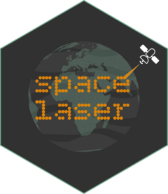

<!-- README.md is generated from README.Rmd. Please edit that file -->

```{r, include = FALSE}
knitr::opts_chunk$set(
  collapse = TRUE,
  comment = "#>",
  fig.path = "man/figures/README-",
  out.width = "100%"
)
```

# spacelaser <a href="https://belian-earth.github.io/spacelaser/"></a>

<!-- badges: start -->
[](https://lifecycle.r-lib.org/articles/stages.html#experimental)
[](https://extendr.github.io/extendr/extendr_api/)
[](https://www.apache.org/licenses/LICENSE-2.0)
[](https://app.codecov.io/gh/belian-earth/spacelaser)
[](https://github.com/belian-earth/spacelaser/actions/workflows/R-CMD-check.yaml)
<!-- badges: end -->

Fast cloud-optimized partial reading of GEDI and ICESat-2 HDF5 data from R.
Only the bytes needed for the requested spatial/temporal subset are fetched over
HTTP, avoiding multi-gigabyte downloads.


## Installation

Requires a [Rust toolchain](https://www.rust-lang.org/tools/install)
(cargo + rustc).

``` r
# install.packages("pak")
pak::pak("belian-earth/spacelaser")
```

## Authentication

All reads go through NASA Earthdata, which requires a free account. Register at <https://urs.earthdata.nasa.gov/>.

Credentials can be supplied in any of the following ways:

- **Environment variables** — set `EARTHDATA_USERNAME` and
  `EARTHDATA_PASSWORD`. Convenient for CI and shell sessions.

- **A `.netrc` file** — add an entry for `urs.earthdata.nasa.gov` to
  `~/.netrc` (or `_netrc` on Windows). spacelaser will read it directly.
  
- [**`earthdatalogin`**](https://boettiger-lab.github.io/earthdatalogin/) — the simplest option if you don't already have a
  netrc set up:

```{r auth, eval = FALSE}
# install.packages("earthdatalogin")
earthdatalogin::edl_netrc()
```

This writes a netrc for you and is interoperable with other R
Earthdata tools.

## Example with GEDI L2A

```{r example, eval=TRUE}
library(spacelaser)

bbox <- sl_bbox(-124.04, 41.39, -124.01, 41.42)

granules <- sl_search(
  bbox,
  product = "L2A",
  date_start = "2022-01-01",
  date_end = "2023-01-01"
)
gedi2a <- sl_read(granules)

gedi2a

g <- gedi2a[gedi2a$quality_flag == 1, ]

plot(
  g$geometry,
  pch = 21,
  cex = 1.5,
  bg = hcl.colors(100, "Viridis", alpha = 0.7)[
    findInterval(g$rh98, seq(0, 100), all.inside = TRUE)
  ]
)

```

## Exploring other products

`sl_columns()` lists what a product offers. All 12 GEDI and ICESat-2
products supported by spacelaser use the same two verbs
(`sl_search()` → `sl_read()`); only the product string and column
names change.

```{r cols, eval = TRUE}
# ICESat-2 photon-level data — full column inventory
sl_columns("ATL03", set = "all")
```


## Supported products

### GEDI

| Product | Description                                   |
|:--------|:----------------------------------------------|
| L1B     | Geolocated waveforms |
| L2A     | Ground elevation, relative height metrics  |
| L2B     | Canopy cover fraction and vertical profile    |
| L4A     | Footprint-level aboveground biomass density   |
| L4C     | Waveform structural complexity index          |

### ICESat-2

| Product | Description                          |
|:--------|:-------------------------------------|
| ATL03   | Geolocated photon heights            |
| ATL06   | Land ice surface elevation           |
| ATL07   | Sea ice surface elevation            |
| ATL08   | Terrain height, canopy height, and canopy cover  |
| ATL10   | Sea ice freeboard                    |
| ATL13   | Inland water surface data         |
| ATL24   | Coastal and Nearshore bathymetry      |

## Why spacelaser

The standard R workflow for GEDI / ICESat-2 data is to download whole
HDF5 granules, then filter locally. For a typical spatial subset query
that wastes minutes and gigabytes — the file you're filtering is
usually orders of magnitude larger than the answer you actually want.

Spacelaser sends HTTP range requests against the remote files and
returns just the rows that fall inside your bounding box, with no
local caching needed.

The result is incredibly fast and efficient remote data access. Cold-cache benchmark, GEDI L2A, 0.03° × 0.03° bbox over Gabon, 2 years, 11 granules, ecologist-realistic column set:

| | spacelaser | curl + hdf5r (status quo) |
|---|---|---|
| Wall time | **70 s** | 1,568 s |
| Bytes downloaded | (small) | 27 GiB |
| Disk used | 0 | 27 GiB |
| Output | 1,246 shots × 112 cols | 1,246 shots × 112 cols (bit-perfect equivalent) |

That's a **22.5×** speedup, robustly **15-22×** across runs depending
on network conditions. Full methods and results can be found in [`benchmarks/`](https://github.com/belian-earth/spacelaser/tree/main/benchmarks).

## Acknowledgements

spacelaser is a Rust reimplementation of the partial-HDF5 reading
approach pioneered by
**[h5coro](https://github.com/SlideRuleEarth/h5coro)** (NASA SlideRule
Earth). The core idea underpinning this package, targeted HTTP Range requests 
against cloud-hosted HDF5 granules instead of downloading the full files,
is theirs. This package brings that idea to R with a GEDI/ICESat-2-specific 
API and a ground-up Rust parser.


### Data

- [**GEDI**](https://www.earthdata.nasa.gov/data/instruments/gedi-lidar): NASA GEDI Science Team, distributed by LP DAAC and ORNL DAAC
- [**ICESat-2**](https://icesat-2.gsfc.nasa.gov/): NASA ATLAS Instrument and Science Teams, distributed by
  NSIDC DAAC


